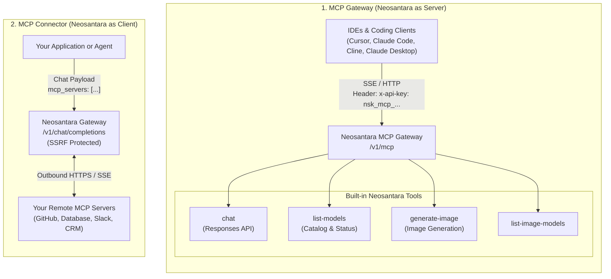

Neosantara implements the Model Context Protocol (MCP) in two distinct roles: as an **MCP Gateway (Server)** providing tools to local IDEs and agents, and as an **MCP Connector (Client)** connecting AI models to your remote MCP servers.

## Comparing the Two MCP Roles

| Criteria | MCP Gateway (Server) | MCP Connector (Client) |
| :--- | :--- | :--- |
| **Neosantara Role** | Tool Provider (Server) | Tool Consumer (Client) |
| **Endpoint** | `https://api.neosantara.xyz/v1/mcp` | `https://api.neosantara.xyz/v1/chat/completions` |
| **Auth Format** | Dedicated MCP key (`nsk_mcp_...`) | Standard Gateway API key (`nsk_...`) |
| **Primary Audience** | Coding IDEs, CLI agents, Claude Desktop | Backend applications, autonomous bots, agent pipelines |
| **Operation** | External client invokes Neosantara built-in tools | Gateway invokes your MCP servers during model inference |
| **Protocol** | SSE or Streamable HTTP JSON-RPC | Outbound Streamable HTTP and SSE with SSRF protection |

## When to Use Each Mode

### Use MCP Gateway When:
- You want to connect coding IDEs (Cursor, Windsurf) or Claude Desktop to Neosantara AI capabilities.
- You need tools such as image generation or model catalog discovery directly from an IDE chat window.
- You configure CLI agents such as Claude Code to call Neosantara tools.

### Use MCP Connector When:
- You build applications where LLMs need access to private databases, internal APIs, or third-party services through your own MCP servers.
- You want to avoid writing client-side tool-calling orchestration loops. Simply provide your MCP server URLs, and Neosantara handles tool discovery, execution, and response synthesis automatically.

## Related Guides

<CardGroup cols={2}>
  <Card title="MCP Connector" icon="network" href="/en/agents/mcp-connector">
    Connect chat models to your remote MCP servers automatically.
  </Card>
  <Card title="MCP API Keys" icon="key" href="/en/agents/mcp-keys">
    nsk_mcp_ key format, tier rate limits, and creation instructions.
  </Card>
  <Card title="Coding Agents & IDEs" icon="laptop" href="/en/agents/claude-code">
    Setup guides for Claude Code, OpenCode, Cursor, and Cline.
  </Card>
  <Card title="Claude Desktop" icon="monitor" href="/en/agents/claude-desktop">
    Configure Claude Desktop application with Neosantara SSE transport.
  </Card>
</CardGroup>
