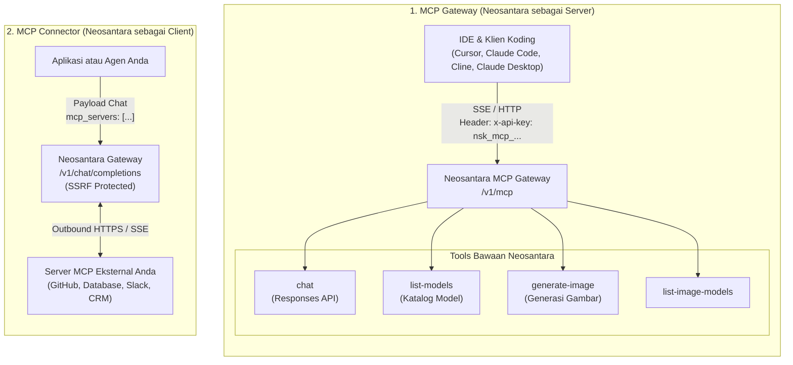

Neosantara mengimplementasikan Model Context Protocol (MCP) dalam dua peran terpisah: sebagai **MCP Gateway (Server)** untuk menyediakan tools ke IDE dan agen lokal, serta sebagai **MCP Connector (Client)** untuk menghubungkan model AI ke server MCP eksternal milik Anda.

## Perbandingan Dua Peran MCP

| Kriteria | MCP Gateway (Server) | MCP Connector (Client) |
| :--- | :--- | :--- |
| **Peran Neosantara** | Menyediakan tools (Server) | Mengonsumsi tools (Client) |
| **Endpoint** | `https://api.neosantara.xyz/v1/mcp` | `https://api.neosantara.xyz/v1/chat/completions` |
| **Format Autentikasi** | API key MCP khusus (`nsk_mcp_...`) | API key Gateway standar (`nsk_...`) |
| **Pengguna Utama** | IDE koding, CLI agent, Claude Desktop | Aplikasi backend, bot otonom, pipeline agent |
| **Cara Kerja** | Klien eksternal memanggil tools bawaan Neosantara | Gateway memanggil server MCP Anda saat inferensi model |
| **Protokol** | SSE atau Streamable HTTP JSON-RPC | Streamable HTTP dan SSE outbound dengan proteksi SSRF |

## Kapan Menggunakan Setiap Mode

### Gunakan MCP Gateway Saat:
- Anda ingin menghubungkan IDE koding (Cursor, Windsurf) atau Claude Desktop ke kapabilitas AI Neosantara.
- Anda memerlukan tools seperti pembuatan gambar atau katalog model langsung dari jendela percakapan IDE.
- Anda mengonfigurasi agen CLI seperti Claude Code untuk memanggil tools Neosantara.

### Gunakan MCP Connector Saat:
- Anda membangun aplikasi yang membutuhkan model LLM untuk mengakses database pribadi, API internal, atau layanan pihak ketiga melalui server MCP Anda sendiri.
- Anda tidak ingin menulis kode orkestrasi tool-calling manual di sisi klien. Cukup berikan URL server MCP Anda, dan Neosantara akan mengelola penemuan tools, pemanggilan fungsi, dan penanganan respons secara otomatis.

## Panduan Terkait

<CardGroup cols={2}>
  <Card title="MCP Connector" icon="network" href="/id/agents/mcp-connector">
    Hubungkan model chat ke server MCP eksternal milik Anda secara otomatis.
  </Card>
  <Card title="API Key MCP" icon="key" href="/id/agents/mcp-keys">
    Format key nsk_mcp_, batas rate per tier, dan cara pembuatannya.
  </Card>
  <Card title="Asisten Koding & IDE" icon="laptop" href="/id/agents/claude-code">
    Panduan konfigurasi untuk Claude Code, OpenCode, Cursor, dan Cline.
  </Card>
  <Card title="Claude Desktop" icon="monitor" href="/id/agents/claude-desktop">
    Konfigurasikan aplikasi desktop Claude dengan transport SSE Neosantara.
  </Card>
</CardGroup>
